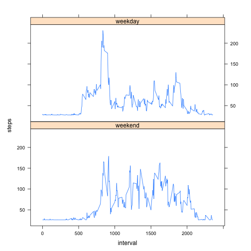

This is an R Markdown document for Coursera Reproducible Research Peer Assessment 1

The first step is to set the working directory and read the data into R

```r
setwd("/Users/Matt/Desktop/Data ScienceCoursera/Reproducible Research/Project 1")
readdata <- read.csv("activity.csv")
```


This next chunk finds the sum of steps per day and plots it in histogram form

```r
data <- aggregate(steps ~ date, data = readdata, sum, na.rm = TRUE)
hist(data$steps)
```

 

Next we find the mean and median values of steps per day

```r
mean(data$steps)
```

```
## [1] 10766.19
```

```r
median(data$steps)
```

```
## [1] 10765
```

This plots the 5 minute interval average number of steps taken across all days

```r
data_sub <- aggregate(steps ~ interval, data = readdata, mean, na.rm = T)
plot(data_sub$interval, data_sub$steps, type = "l")
```

 

Finds the 5-minute interval (averaged across all days) that contains the maximum number of steps

```r
data_sub[which(data_sub$steps == max(data_sub$steps)),1]
```

```
## [1] 835
```

This totals the amount of missing data in the dataset

```r
sum(is.na(readdata$steps))
```

```
## [1] 2304
```

This chunk creates a new data set (data_set2), similar to the original, except the NA values are filled in with the maximum average total steps per interval from the original data set

```r
data_set2 <- readdata
data_set2$steps[is.na(data_set2$steps)] <- max(data_sub$steps)
```

This plots a histogram of the new data set and calculates the mean and median of the new data set

```r
data_sub2 <- aggregate(steps ~ date, data = data_set2, sum)
hist(data_sub2$steps)
```

 

```r
#mean
mean(data_sub2$steps)
```

```
## [1] 17141.36
```

```r
#median
median(data_sub2$steps)
```

```
## [1] 11458
```

```r
#by imputing data for missing values, the mean and median both increased. This is no surprise because I filled the missing data with the maximum average steps per interval.
```


This creates a factor variable with 2 levels and then plots average number of steps for weekend and weekdays

```r
data_set2$date <- as.Date(data_set2$date)
data_set2$day <- weekdays(data_set2$date)
data_set2$day2 <- ifelse(data_set2$day == "Sunday" | data_set2$day == "Saturday", "weekend", "weekday")
data_set2$day3 <- factor(data_set2$day2, levels = c("weekend", "weekday"))
```

Create panel plot

```r
pplot = aggregate(steps ~ interval + day3, data_set2, mean)
library(lattice)
xyplot(steps ~ interval | factor(day3), data = pplot, , aspect = 1/2, type = "l")
```

 
